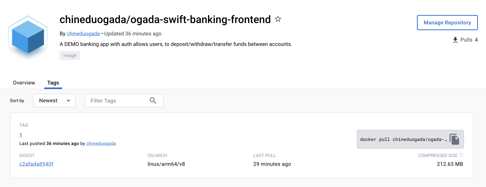
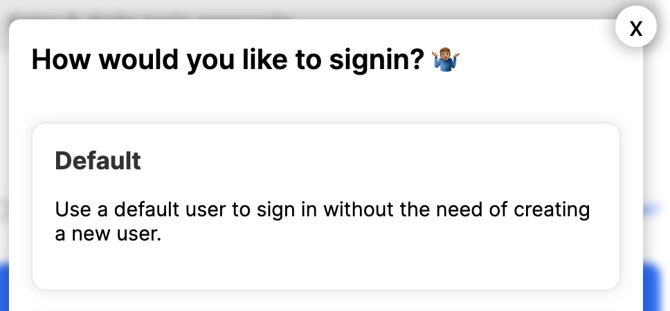

# OGADA-SWIFT-BANKING-FRONTEND-DEV-TEST-DOCKER

## Description

This is a DEMO simple banking application that allows users to create accounts, deposit, withdraw and transfer funds between accounts.

####



## Docker Image

To pull the docker image, run the following command and run manually on your machine

```bash
docker run -p 80:80 chineduogada/ogada-swift-banking-frontend:1
```

## REPO

[OGADA-SWIFT-BANKING-FRONTEND-DEV-TEST](https://github.com/stanleyogada/OGADA-SWIFT-BANKING-FRONTEND-DEV-TEST-DOCKER)

## Technologies

[React](https://reactjs.org/)
[Node](https://nodejs.org/en/)
[Express](https://expressjs.com/)
[PostgreSQL](https://www.postgresql.org/)

## Quick Test on your local machine

### Prerequisites

1. Install the following on your machine

- [Docker](https://docs.docker.com/get-docker/)
- [Docker Compose](https://docs.docker.com/compose/install/)

2. Start Docker-Desktop on your machine

### Steps

1. Clone the repository

```bash
git clone https://github.com/stanleyogada/OGADA-SWIFT-BANKING-FRONTEND-DEV-TEST-DOCKER.git
```

2. Navigate to the root directory of the project

```bash
cd OGADA-SWIFT-BANKING-FRONTEND-DEV-TEST-DOCKER
```

3. Run the following command to start the application

```bash
docker-compose up
```

4. Open your browser and navigate to `http://localhost`

5. While in the browser, click on the first option to sign in as a test user
   

6. To stop the application, run the following command

```bash
[ctrl + c]
```

```bash
docker-compose down
```
